# AI-Powered Business Analytics \& Decision Intelligence Platform

# 

# Overview

# 

# This project is an enhanced version of the Superstore Sales Analysis project. It combines Python, SQL, Power BI, Streamlit, Machine Learning, and Google Gemini AI to provide interactive analytics, forecasting, business insights, and decision-support recommendations.

# 

# Problem Statement

# 

# The objective of this project is to analyze sales data from a retail superstore and generate actionable insights for business decision-making. The project involves data cleaning, transformation, exploratory analysis, visualization, forecasting, and AI-powered recommendations.

# 

# Features

# 

# \* CSV Upload

# \* KPI Dashboard

# \* Region Filter

# \* Category Filter

# \* Monthly Sales Trend

# \* Top Customers Analysis

# \* Top Products Analysis

# \* Sales Forecasting

# \* AI Insights

# \* AI Business Recommendations

# \* Chat With Data

# \* PDF Report Generation

# 

# Tech Stack

# 

# \* Python

# \* Pandas

# \* NumPy

# \* Streamlit

# \* Scikit-Learn

# \* Google Gemini AI

# \* ReportLab

# \* Power BI

# \* SQL

# 

# Solution

# 

# The project leverages Python for data cleaning and transformation, SQL for data storage and querying, Power BI for interactive visualization, and Streamlit for web-based analytics. Machine Learning is used for sales forecasting, while Google Gemini AI generates business insights and recommendations.

# 

# Enhancements Added

# 

# Compared to the original Superstore Sales Analysis project, the following enhancements were implemented:

# 

# \* Streamlit Web Application

# \* AI-Powered Insights using Gemini

# \* AI Business Recommendations

# \* Sales Forecasting Module

# \* Chat With Data Feature

# \* PDF Report Generation

# \* Cloud Deployment using Streamlit Cloud

# \* Enhanced Dashboard Visualizations

# 

# Project Structure

# 

# \* AI\_Insights

# \* dataset

# \* Documentation

# \* PowerBI

# \* Python

# \* Screenshots

# \* SQL

# 

# Screenshots

### Dashboard Home
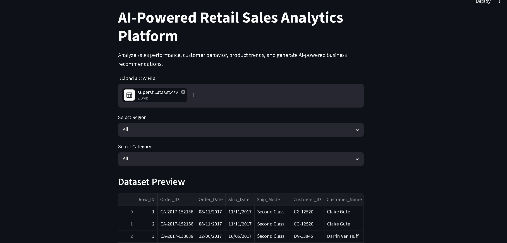

### AI Insights
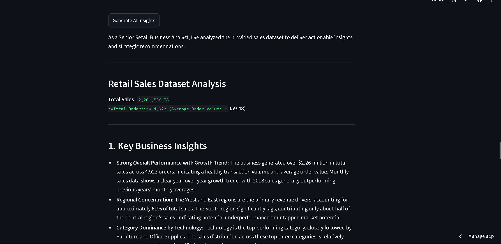

### AI Recommendations
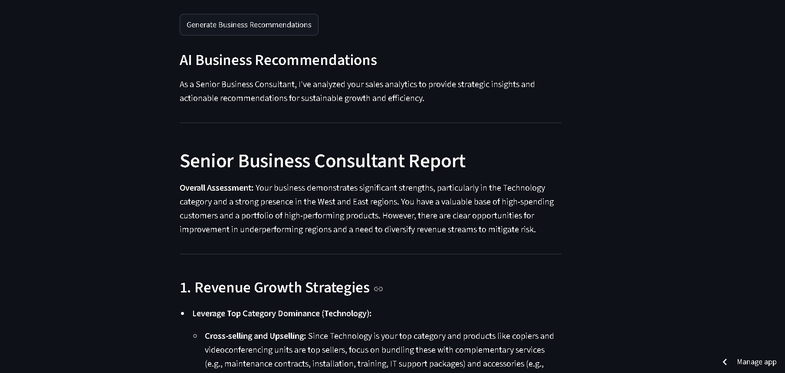

### Business Insights
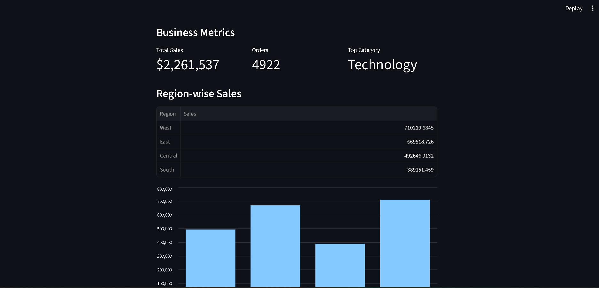

### Category Sales
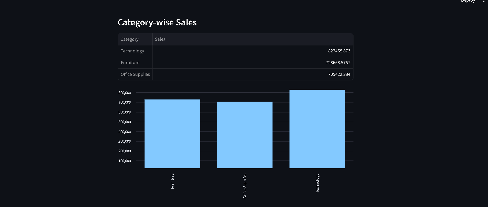

### Monthly Trend
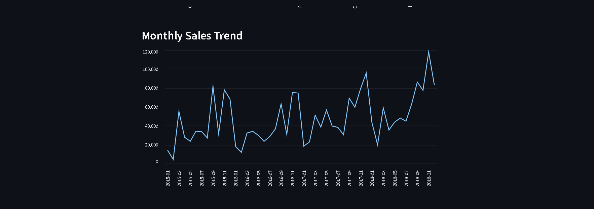

### Region Sales
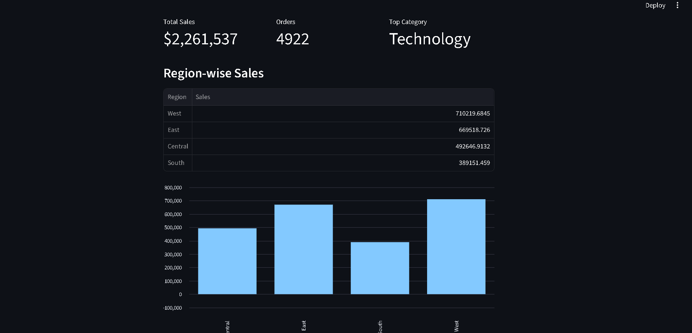

### Sales Forecast
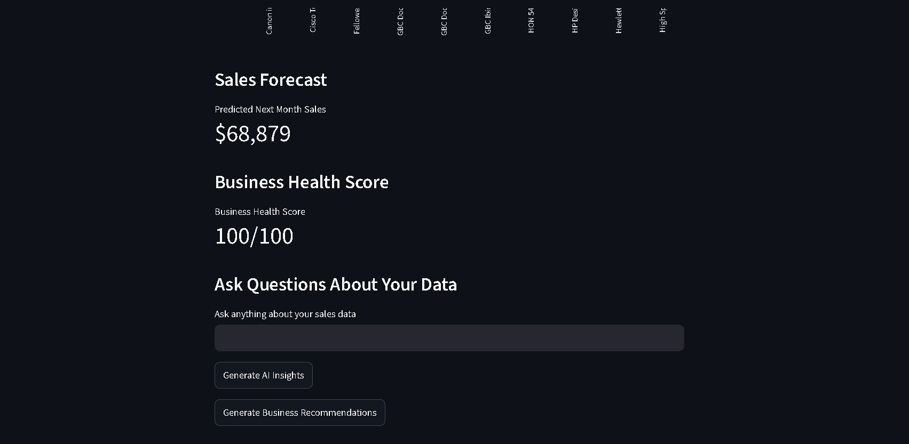

### Top Customers
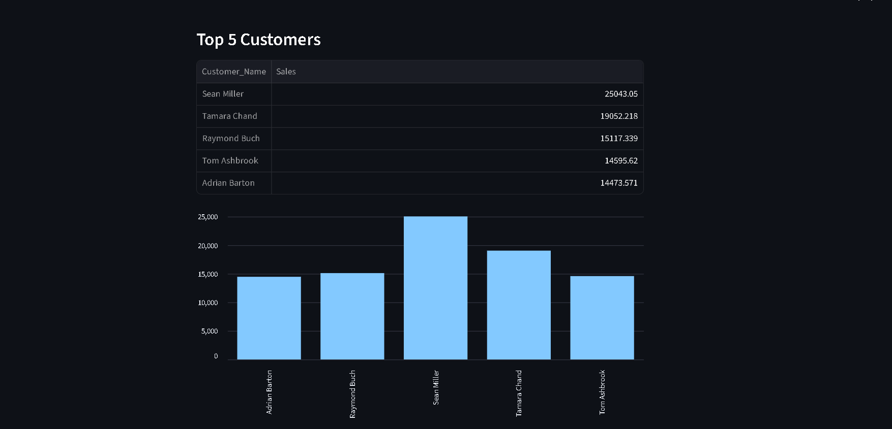

### Top Products
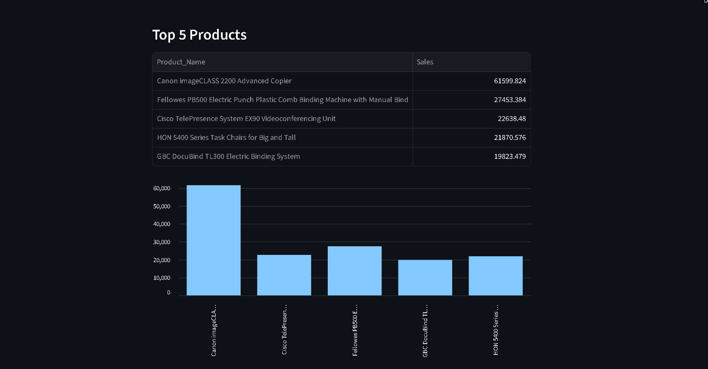

### Upload CSV
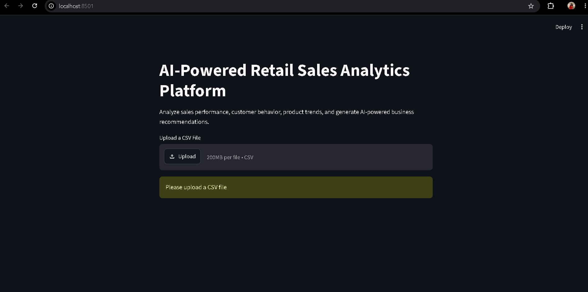

# Live Demo

# 

[Launch Application](https://ai-powered-business-analytics-platform-w4gyy8w8grlrguhs8chpjv.streamlit.app)

# 

